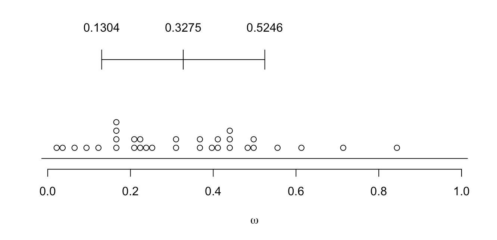
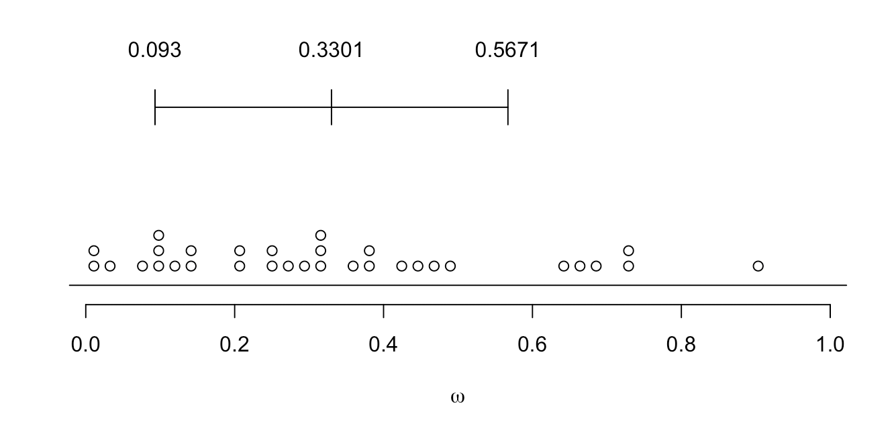
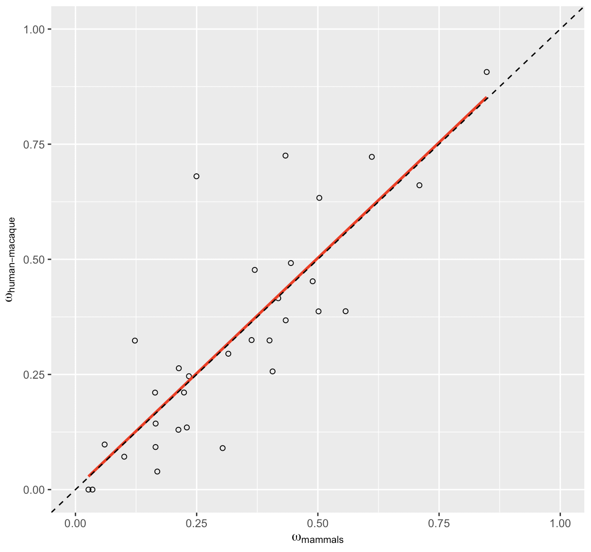
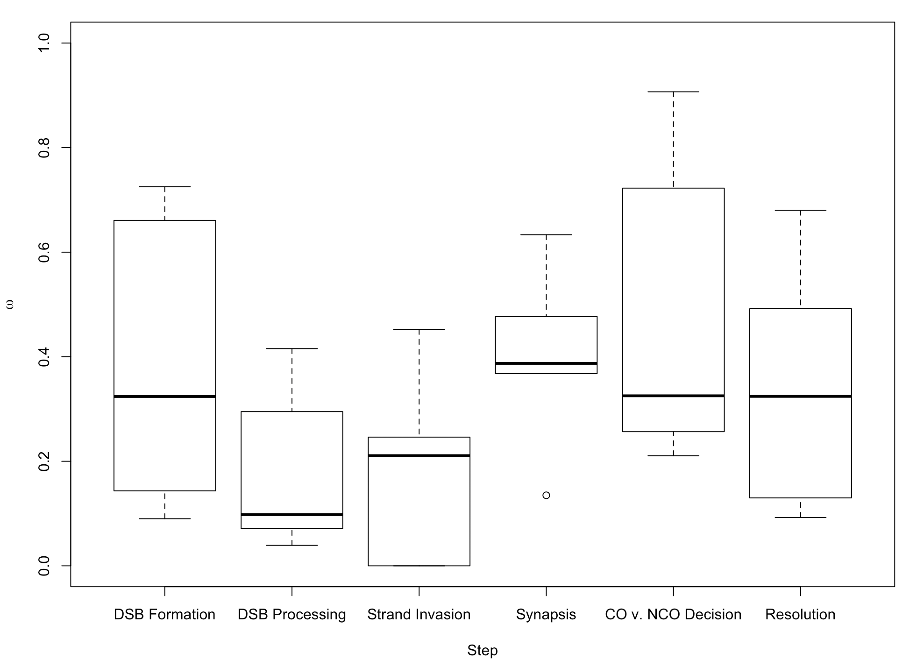

**Molecular Evolution of the Meiotic Recombination Pathway in Mammals**

*Investigations*

$~$

Amy L. Dapper^1,2^* and Bret A. Payseur^1^

$~$

^1^ Laboratory of Genetics, University of Wisconsin, Madison, WI 53706, USA

^2^ Department of Biological Sciences, Mississippi State University, Mississippi State, MS 39762, USA

\pagebreak

Running Title: Evolution of the Recombination Pathway

Keywords: (up to 5)

$~$

\* Corresponding Author : Amy L. Dapper

Address: 295 E. Lee Blvd., P.O. Box GY, Mississippi State, MS 39762

Phone: (662) 325-7575

Email: dapper@biology.msstate.edu

\pagebreak

## Abstract

Meiotic recombination, the exchange of genetic material between homologous chromosomes during meiosis, is required for successful gametogenesis in most sexually reproducing species. Recombination is also a fundamental evolutionary force, influencing the fate of new mutations and determining the genomic scale over which selection shapes genetic variation. Despite the central importance of recombination, basic questions about its evolution have yet to be addressed.  Although many genes that play roles in recombination have been identified, the molecular evolution of most of these genes remains uncharacterized.  Using a phylogenetic comparative approach, we measure rates of evolution in 32 recombination pathway genes across 16 mammalian species, spanning primates, murids, and laurasithians.  By analyzing a carefully-selected panel of genes involved in key components of recombination – spanning double strand break formation, strand invasion, the crossover/non-crossover decision, and resolution – we generate a comprehensive picture of the evolution of the recombination pathway in mammals. Recombination genes exhibit marked heterogeneity in the rate of protein evolution, both across and within genes.  We report signatures of rapid evolution and positive selection that could underlie species differences in recombination rate.  **[NEEDS WORK HERE]**

Abstract Word Count : (< 250)

\pagebreak

## Introduction

The reciprocal exchange of DNA between homologous chromosomes during meiosis – recombination – is required for successful gametogenesis in most species that reproduce sexually [@Hassold2001]. The rate of recombination is a major determinant of patterns of genetic diversity in populations, influencing the fate of new mutations [@Hill1966], the efficacy of selection [@Felsenstein1974; @Charlesworth1993; @Comeron1999; @Gonen2017], and important features of the genomic landscape [@Begun1992; @Charlesworth1994; @Duret2008]. 

Although recombination rate is often treated as a constant, this fundamental parameter evolves over time. Genomic regions ranging in size from short sequences to entire chromosomes vary in recombination rate – both within and between species [@Burt1987; @Broman1998; @Jeffreys2005; @Coop2007; @Kong2010; @Smukowski2011; @Dumont2011B; @Comeron2012; @Segura2013; @Dapper2017; @Stapley2017].

Genome-wide association studies are beginning to reveal the genetic basis of differences in recombination rate within species. Individual recombination rates have been associated with variation in specific genes in populations of *Drosophila melanogaster* [@Hunter2016], humans [@Kong2008; @Chowdhury2009; @Fledel-Alon2011; @Kong2014], domesticated cattle [@Sandor2012; @Ma2015; @Kadri2016; @Shen2018], domesticated sheep [@Petit2017], Soay sheep [@Johnston2016], and red deer [@Johnston2018]. Variants in several of these genes correlate with recombination rate in multiple species, including: *Rnf212* [@Kong2008; @Chowdhury2009; @Fledel-Alon2011; @Sandor2012; @Johnston2016; @Kadri2016; @Petit2017], *Rnf212B* [@Johnston2016; @Kadri2016; @Johnston2018], *Rec8* [@Sandor2012; @Johnston2016; @Johnston2018], *Hei10/Ccnb1ip1* [@Kong2014; @Petit2017], *Msh4* [@Kong2014; @Ma2015; @Kadri2016; @Shen2018], *Cplx1* [@Kong2014; @Ma2015; @Johnston2016; @Shen2018] and *Prdm9* [@Fledel-Alon2011; @Sandor2012; @Kong2014; @Ma2015; @Shen2018].  

In contrast, the genetics of recombination rate variation among species remains poorly understood. Divergence at the di-cistronic gene *mei-217/mei-218* explains much of the disparity in genetic map length between *D. melanogaster* and *D. mauritiana* [@Brand2018]. *mei-217/mei-218* is the only gene known to confer a recombination rate difference between species, though quantitative trait loci that contribute to shifts in rate among subspecies of house mice have been identified [@Dumont2010; @Murdoch2010; @Balcova2016]. 

One strategy for understanding how species diverge in recombination rate is to inspect patterns of molecular evolution at genes involved in the recombination pathway. This approach incorporates knowledge of the molecular and cellular determinants of recombination and is motivated by successful examples. *mei-217/mei-218* was targeted for functional analysis based on its profile of rapid evolution between *D. melanogaster* and *D. mauritiana* [@Brand2018]. *Prdm9*, a protein that positions recombination hotspots in house mice and humans through histone methylation [@Myers2010; @Parvanov2010; @Grey2011; Paigen2018; @Grey2018], shows accelerated divergence across mammals [@Oliver2009]. The rapid evolution of *Prdm9* – which localizes to its zinc-finger DNA binding domain [@Oliver2009] – appears to be driven by selective pressure to recognize new hotpot motifs as old ones are destroyed via biased gene conversion [@Myers2010; @Ubeda2011; @Lesecque2014; @Latrille2017]. Although these examples demonstrate the promise of signatures of molecular evolution for illuminating recombination rate differences between species, patterns of divergence have yet to be reported for most genes involved in meiotic recombination.

Mammals provide a useful system for dissecting the molecular evolution of the recombination pathway for several reasons. First, the evolution of recombination rate has been measured along the mammalian phylogeny [Dumont and Payseur 2008; @Segura2013]. Second, recombination rate variation has been associated with specific genes in mammalian populations [@Kong2008; @Chowdhury2009; @Sandor2012; @Kong2014; @Ma2015; @Johnston2016; @Kadri2016; @Petit2017; @Johnston2018; @Shen2018]. Third, laboratory mice have proven to be instrumental in the identification and functional characterization of recombination genes [@deVries1999; @Yang2006; @Ward2007; @Baudat2000; @Romanienko2000; @LaSalle2012; @Schramm2011; @Bisig2012; @Bolcun-Filas2012; @Kumar2015; @Finsterbusch2016; @Stanzione2016] .

Work in mice indicates that the mammalian recombination pathway is roughly divided into five major steps, each of which is regulated by a handful of genes. The first step is the formation of hundreds of double strand breaks (DSBs) throughout the genome [@Keeney1997; @Bergerat1997; @Baudat2000; @Romanienko2000; @Baudat2007; @Finsterbusch2016; @Lange2016]. After formation, DSBs are identified, processed, and paired with their corresponding location on the homologous chromosome through the processes of homology search and strand invasion [@Keeney2007; @Cloud2012; @Brown2014; @Oh2016; @Kobayashi2016; @Finsterbusch2016; @Xu2017]. The pairing of homologous chromosomes is then stabilized by a proteinaceous structure referred to as the synaptonemal complex (SC) [@Meuwissen1992; @Schmekel1995; @Costa2005; @deVries2005; @Hamer2006; @Yang2006; @Schramm2011; @Fraune2014; @Hernandez2016]. The SC also forms a substrate on which the eventual crossover events will take place [**citations**].  It is at this point that a small subset of DSBs is designated to mature into crossovers, leaving the majority of DSBs to be resolved as non-crossovers [@Snowden2004; @Yang2008; @Reynolds2013; @Finsterbusch2016; @Rao2017].  Finally, this designation is followed, and each DSB is repaired as a crossover or a non-crossover [@Baker1996; @Edelmann1996; @Lipkin2002; @Rogacheva2014; @Xu2017].  

In this article, we examine the molecular evolution of 32 key recombination genes, evenly distributed across each major step in the recombination pathway, in 16 mammalian species spanning primates, murals and laurasiatherians. Our results identify steps of the pathway most likely to contribute to differences in recombination rate between species.  

## Materials and Methods

### Data Acquisition & Processing

We selected a focal panel of 32 recombination genes (See Table1). The panel was constructed to: (1) cover each major step in the recombination pathway as evenly as possible, (2) contain genes that have integral functions in each step, and (3) include genes that have been associated with inter-individual differences in recombination rate within mammalian populations. Reference sequences from 16 species of mammals for each gene  were downloaded from both NCBI and Ensembl (Release-89)[@Wheeler2006; @Zerbino2017].

Alternative splicing is widespread and presents a challenge for molecular evolution studies [@Pan2008; @Barbosa2012]. To focus our analyses on coding sequences that are transcribed during meiosis and to validate the computational annotations for each gene in each species, we used available testes expression datasets. We downloaded raw testes expression data for each species from NCBI Gene Expression Omnibus (GEO) (Table S1)[@Barrett2012]. We converted the SRA files into FASTQ files using SRAtoolkit [@Leinonen2010]. The reads were mapped to an indexed reference genome (Table S2,3) (Bowtie2, [@Langmead2012]) using TopHat [@Trapnell2009]. The resulting bam files were sorted using Samtools [@Li2009] and visualized using IGV 2.4.10 [@Thorvaldsdottir2013]. We used this approach to: (1) identify the transcript expressed in testes, (2) check the reference transcript for errors, and (3) revise the reference transcript based upon the transcript data.

We compared expression data to annotations from both Ensembl and NCBI [@Wheeler2006; @Zerbino2017]. When both transcripts were identical, we selected the NCBI transcript.  The Ensembl transcript was used instead when: (1) the NCBI reference sequence was not available, (2) when none of the NCBI transcripts matched the expression data, or (3) when there were sequence differences between the two transcripts and the Ensembl transcript was more parsimonious - (i.e. had the fewest differences when compared to the rest of sequences in the alignment).  The use of testes expression data was a key quality control step and the inclusion of species in this study was primarily determined by the availability of testes expression data.

###  Phylogenetic Comparative Approach 

For each gene, we used phylogenetic analysis by maximum likelihood (PAML 4.8) to measure the rate of evolution across the mammalian phylogeny and to search for molecular signatures indicative of positive selection (Table 2) [@Yang1997; @Yang2007]. This approach requires a sequence alignment and a phylogenetic tree.  For each gene, sequences were aligned using Translator X, a codon-based alignment tool, powered by MUSCLE v3.8.31 [@Edgar2004; @Abascal2010]. Each alignment was examined by hand and edited as necessary. We used a species tree that reflects current understanding of the phylogenetic relationships of the species included in our study (Figure 1)[@Prasad2008; @Perelman2011; @Fan2013; @Chen2017].

Due to the ambiguity in the relationship between laurasithians and the placement of tree shrews, we also inferred gene trees using MrBayes [@Ronquist2012; @Fan2013; @Chen2017]. This approach allowed us to account for effects of incomplete lineage sorting (ILS) [@Pamilo1988; @Rosenberg2002; @Scornavacca2017].  Using gene trees and using the consensus species tree produced highly similar results (Table S4).

For 19 genes, transcripts from all 16 species were used. For 11 genes in which the chimpanzee and bonobo sequences were identical, we excluded the bonobo sequence. For one gene in which the chimpanzee, bonobo and human sequences were all identical, we excluded the chimpanzee and bonobo sequences. **In only a small number of instances, a suitable reference sequence could not be identified for a given species.** 

We estimated rates of synonymous and non-synonymous substitutions per site using the CODEML program in PAML4.8 [@Yang2007]. This program considers multiple substitutions per site, different rates of transitions and transversions, and effects of codon usage [@Yang2007]. Rates of substitution were computed for 6 different models of molecular evolution (Table 2). The fit of each model was compared using a likelihood ratio test. Reported substitution rates assume the best-fit model for each gene.

### Identifying Signatures of Selection

To test for positive selection, we compared the fit of models including a class of sites with $\omega$ greater than 1 to the fit of models in which all classes of sites have $\omega$ values equal to, or less than, 1.  Specifically, we report three comparisons: M1 vs. M2, M7 vs. M8, and M8 vs. M8a (Table 2). The first comparison, M1 vs. M2, compares a model with two classes of sites ($\omega$  < 1, $\omega$ = 1) to a model with a third class of sites where $\omega$ is greater than 1, indicative of positive selection [@Yang2007]. More complex models (M7 & M8) were developed to take into account variation in $\omega$ less than 1 among sites within genes by including 10 site classes drawn from a beta distribution ranging between 0 and 1 [@Yang2007]. In this case, Model 8 includes one additional class of sites in which $\omega$ is greater than 1 (for a total of 11 site classes), allowing for the identification of signatures of positive selection [@Yang2007]. In cases in which a large fraction of sites within a gene are evolving neutrally ($\omega$ = 1), Model 8 will fit significantly better due to a very poor fit of Model 7 rather than a signature of positive selection. To avoid incorrectly identifying signatures of positive selection, Model 8 is also compared to Model 8a which contains a larger fraction of neutrally evolving sites than Model 7 [**citations**].  **We also report the number of significant Bayes-Empirical-Bayes (BEB) $\omega$ estimates for individual codons in each gene.** 

### Multinucleotide Mutations

Multi-nucleotide mutations (MNMs) occur when two mutations happen simultaneously in close proximity [@Schrider2011; @Besenbacher2016]. MNMs violate the PAML assumption that the probability of two simultaneous mutations in the same codon is 0 [@Yang2007; @Venkat2018]. Recent work has shown that MNMs can lead to the false inference of positive selection when using branch-site tests in PAML [@Venkat2018]. Although we did not use branch-site tests, it is possible that MNMs contributed to some of the signatures of positive selection we observed. Although we could not directly identify MNMs in our dataset, we conducted an additional analysis to gauge the potential effects of MNMs on our results.  We used PAML to reconstruct the ancestral sequence at each node in the phylogeny [@Yang2007]. For the reconstruction, Model 8 was chosen because we specifically re-analyzed genes that showed evidence for positive selection when comparing Model 7 with Model 8.  From the ancestrally reconstructed sequences, we identified any codons in which PAML inferred more than 1 substitution on a single branch (codons with multiple differences; CMDs).  All identified CMDs were removed from the sequences in which they occurred. For example, if a CMD was identified in an external branch, that codon was replaced with ‘---’ only in the sequence of that species. If a CMD was inferred on an internal branch, the codon was replaced with ‘---’ in all species descended from that internal branch.  For each gene that showed evidence of positive selection using the unedited sequences, we also conducted PAML analyses using sequences from which all CMDs were removed.

###  Polymorphism & Divergence in the Primate Lineage

To further examine evidence for selection on recombination genes, we compared divergence between humans and macaque to polymorphism within humans in the recombination genes.  Human polymorphism data was downloaded from ExAC database [@Lek2016]. The ExAC database spans 60,706 unrelated individuals sequenced as part of both disease-specific and population genetic studies [@Lek2016].  To avoid biases introduced by population structure, we restricted our analyses to the population with the largest representation in the database: European, non-Finnish, individuals (*N* = 33,370)[@Lek2016].  Polymorphism data for the correct transcript of RNF212 (based upon expression data) was not available in the ExAC database; this gene was not included in this analysis.     

We compared counts of non-synonymous and synonymous polymorphisms to counts of non-synonymous and synonymous substitutions using the McDonald-Kreitman test [@Mcdonald1991].  The neutral expectation is that the ratio of non-synonymous to synonymous substitutions is equal to the ratio of non-synonymous to synonymous polymorphisms [@Mcdonald1991].  Significant deviations provide evidence of natural selection.  The neutrality index (NI) measures the direction and degree of departures from the neutral expectation [@Charlesworth1994B].  An NI of less than 1 indicates positive selection, and the fraction of adaptive amino acid substitutions can be estimated as 1 - NI [@Charlesworth1994B; @Fay2001; @Smith2002].  We also measure the direction of selection (DoS) for each gene, an additional statistic that measures the direction and degree of departures from the neutral expectation and has been shown to be less sensitive to bias than NI under certain conditions [@Stoletzki2010].  A positive DoS is consistent with positive selection, and vice versa [@Stoletzki2010].  Additionally, we estimated pairwise divergence ($\omega$) between humans and macaques using the *yn00* package in PAML [@Yang2007].

### Identifying Evolutionary Patterns

To identify evolutionary patterns among recombination genes, we compared the rate of evolution and the proportion of genes experiencing positive selection among groups of interest. We asked: (1) Do genes that function in different steps of the pathway exhibit different rates of evolution? (2) Do genes that function post-synapsis evolve more rapidly than genes that function pre-synapsis? and (3) Do genes associated with between-individual variation in recombination rate diverge more rapidly between species? All statistical analyses were performed in R [**citation**].

To determine whether recombination genes co-evolve, we computed the evolutionary rate covariation (ERC) metric: the correlation coefficient between branch-specific rates among pairs of proteins [@Clark2012]. ERC is frequently elevated among interacting proteins [@Pazos2001; @Hakes2007; @Clark2009] and is assumed to result from: (1) concordance in fluctuating evolutionary pressures, (2) parallel evolution of expression level, or (3) compensatory changes between co-evolving genes [@Clark2012; @Clark2013; @Priedigkeit2015]. We used a publicly available ERC dataset (https://csb.pitt.edu/erc_analysis/index.php) to compare the median ERC-value among a subset of the focal recombination genes (*N* = 25) to other genes in the genome, as described in Priedigkeit et al. (2015).

To control for an observed elevation in ERC among recombination genes and test for relationships between specific groups, we also conducted an ERC analysis that was restricted to the focal set of 32 recombination genes.  Branch lengths were calculated using the *aaML* package in PAML [@Yang2007] and pairwise ERC values were calculated following the methods of Clark et al. (2012). Using this approach, we specifically compared the ERC values among three of the most rapidly evolving recombination genes (*TEX11*, *SHOC1*, and *SYCP2*) to the other recombination genes.

\pagebreak

## Results

### Recombination genes evolve at different rates in mammals

We observed substantial heterogeneity in the rate of evolution of recombination genes, spanning a range of 0.0268 – 0.8483 (mean $\omega$ = 0.3275, SD = 0.1971, median = 0.30945) (Figure 2A, Figure 3, Table 3). Four genes exhibit particularly rapid evolution compared to other recombination genes, with evolutionary rates greater than 1 SD above the mean (*IHO1*, *SHOC1*, *SYCP2*, *TEX11*). At the other end of the spectrum, five genes have evolutionary rates more than 1 SD below the mean and are highly conserved across the mammalian phylogeny (*BRCC3*, *DMC1*, *HEI10*, *RAD50*, *RAD51*). In comparisons between human and macaque sequences, six genes have evolutionary rates more than 1 SD above the mean (*CNTD1*, *IHO1*, *MEI4*, *RAD21L*, *SHOC1*, *TEX11*) and six genes have evolutionary rates more than 1 SD below the mean (*DMC1*, *HORMAD1*, *MLH1*, *MRE11*, *RAD50*, *RAD51*). The genes that show the most rapid and most conserved rates of divergence between humans and macaques are mostly the same genes that show extreme evolutionary rates across the mammalian phylogeny.  Notable exceptions include *MEI4* ($\omega$~mammals~ = 0.4332, $\omega$~human-macaque~ = 0.7252), *CNTD1* ($\omega$~mammals~ = 0.2496, $\omega$~human-macaque~ = 0.6803), *HEI10* ($\omega$~mammals~ = 0.1226, $\omega$~human-macaque~ = 0.3235), and *HORMAD1* ($\omega$~mammals~ = 0.3036, $\omega$~human-macaque~ = 0.0901.  In general, there is very high concordance between evolutionary rate across mammals and pairwise divergence between humans and macaques (mean $\omega$ = 0.3301, SD = 0.2370, median = 0.30925)(Spearman's $\rho$ = 0.833774, *p* = 3.11e-9)(Figure 2B, Table 4). It should be noted, however, that these two measures are not independent - divergence between human and macaque sequences was incorporated in the phylogenetic analysis. 

### Recombination genes evolve faster than other genes in primates

Gradnigo et al. (2016) measured the rate of divergence between human and macaque for 3,606 genes throughout the genome. We used this dataset to ask whether the rate of evolution of recombination genes as a group is different than expected from the genome-wide distribution. Mean rates for sets of 32 $\omega$ values randomly sampled from the 3,606-gene list rarely exceeded the mean rate for recombination genes (*p* = 0.0075, 10,000 random draws) (Figure 4), suggesting that recombination genes evolve faster on average, at least between human and macaque. 

### Recombination genes display signatures of positive selection across mammals

Comparing polymorphism within humans to divergence between humans and macaques revealed that 17 out of 31 genes depart from neutral predictions in the form of significant McDonald-Kreitman tests (**Fisher's Exact Test *p* < 0.05**; Table 5). Seventeen genes harbor an excess of non-synonymous polymorphisms (Table 5). This pattern suggests the presence of weakly deleterious mutations at recombination genes in human populations.
Contrary to predictions under this model, however, we detected no significant differences in allele frequencies among non-synonymous polymorphism than synonymous polymorphism (**statistical test, *p* < 0.05**). None of the recombination genes we surveyed displayed a significant excess of non-synonymous substitutions, the expected signature of positive selection. Only one gene (*TEX11*) has a higher ratio  of non-synonymous to synonymous substitutions than non-synonymous to synonymous polymorphisms (*NI* = 0.7879; *DoS* = 0.0534)(Table 5).   

Phylogenetic comparative methods enable the identification of signatures of selection acting on a subset of sites within a gene.  We identified signatures of positive selection in 11 of 32 (34.3%) recombination genes using site models in *CODEML*. These genes include: *IHO1*, *MSH4*, *MRE11*, *NBS1*, *RAD21L*, *REC8*, *RNF212*, *SHOC1*, *SYCP1*, *SYCP2*, and *TEX11* (Table 2). For each of these genes, models that include a fraction of sites where the rate of non-synonymous substitutions is estimated to be greater than the rate of synonymous substitutions ($\omega$ > 1, Model 8) fit better than models that did not include such a class of sites (Model 7, 8a). To mitigate the potential for multi-nucleotide mutations to produce false signatures of positive selection, we re-analyzed this subset of genes after removing any codons inferred to have accumulated multiple changes on a single branch (CMDs). After removing all CMDs, 1 gene (*TEX11*) retained a significant signature of positive selection (Table 5).

### Recombination genes associated with inter-individual differences do not diverge more rapidly between species 

Recombination genes previously associated with inter-individual differences in recombination rate within species do not evolve faster between species of mammals (average $\omega$ = 0.3943 vs. average $\omega$ = 0.2925, respectively; *p* = 0.2381, Mann-Whitney U Test), though the difference in evolutionary rates between these two classes of genes is greater when considering only divergence between humans and macaques (average $\omega$ = 0.4181 vs. average $\omega$ = 0.2839, respectively; *p* = 0.08816, Mann-Whitney U Test).  Likewise, the proportion of recombination genes that exhibit signatures of positive selection is not higher among genes that have been associated with inter-individual differences (5/11 vs. 6/21; *p* = 0.719, **Fisher's Exact Test**). 

### Recombination gene evolution does not depend strongly on position in the pathway

Comparisons among groups of genes assigned to six major steps in the recombination pathway yielded no significant differences in evolutionary rate (mammals: *p* = 0.1422, Kruskal-Wallis Test; human vs. macaque: *p* = 0.2682, Kruskal-Wallis Test)(Figure 6).  Similarly, genes acting before and after synapsis show similar evolutionary rates across mammals (average $\omega$_before = 0.2723 vs. $\omega$_after = 0.3762, *p* = 0.1425, Mann-Whitney U Test)/. Post-synapsis genes show modest evidence of evolving faster than pre-synapsis genes in comparisons between humans and macaques (average $\omega$_before = 0.2514 vs. $\omega$_after = 0.3994, *p* = 0.05827, Mann-Whitney U Test).

### Evolutionary rates are correlated among recombination genes  

We used a publicly available database (https://csb.pitt.edu/erc_analysis/index.php) to measure correlations in evolutionary rate among pairs of recombination genes across mammals.  Recombination genes show levels of evolutionary rate covariation (mean ERC = 0.134) that are significantly higher than the genome-wide distribution of gene pairs (permutation *p* = 0.000358).

Motivated by the findings that *TEX11*, *SYCP2*, and *SHOC1* are three of the most rapidly evolving recombination genes among mammals (Table 3) and that *TEX11* has direct protein-to-protein interactions with both *SHOC1* and *SYCP2* [@Yang2008; @Guiraldelli2018], we focused on rate correlations between these genes.  *TEX11*, *SYCP2*, and *SHOC1* show significantly higher rate correlations (mean ERC = 0.42369) than randomly sampled subsets of recombination genes (permutation *p* = 0.025). 

\pagebreak

## Discussion

While substantial variation in recombination rate has been observed between mammalian species (**citations**), the genetic changes underlying this divergence remain poorly understood.  By measuring the rate of molecular evolution of key genes across the mammalian phylogeny, we have uncovered a detailed portrait of genetic divergence in the recombination pathway. Notably, we observed substantial variation in the rate of evolution of genes in the recombination pathway, ranging from highly conserved genes ($\omega$ = 0.0268) to rapidly diverging genes ($\omega$ = 0.8483).  Importantly, genetic divergence is likely to underlie the observed phenotypic divergence, allowing us to nominate genes and steps of the pathway that have likely contributed to the evolution of recombination rate.  

Inter-individual variation in recombination rate has been linked to a handful of recombination genes in mammals (**citations**), providing an intriguing set of candidate genes for inter-species variation in recombination rate (Table 1).  However, we did not find evidence that genes associated with inter-individual variation in recombination rate evolve more rapidly, or are more likely to have signatures of adaptive evolution, than recombination genes without such associations. This observation indicates that genes that produce inter-individual variation in recombination rate are not more likely to contribute to between species differences than other genes in the recombination pathway. This lack of an association may suggest that genes underlie species differences in recombination rate are subject to strong directional selection within populations, reducing their contribution inter-individual variation, or that genes that are responsible for within-species rate difference may often be targets of diversifying or antagonistic selection, limiting their divergence between species.  This is supported by the observation that variants of RNF212, a gene repeatably associated with inter-individual variation in recombination rate, have different effects on recombination rate in female and male humans [**citations**]. Alternatively, it is possible we did not detect an association because we have imperfect knowledge of the genes responsible for inter-individual variation.  However, the repeated discovery that the same genes are associated with inter-individual variation in recombination rate in diverse species reduces the likelihood of this possibility (**citations**).  

Work in mice indicates that the mammalian recombination pathway is divided into a series of functionally distinct steps, suggesting that position in the recombination pathway may be a good predictor of evolutionary rate.  However, we did not see a strong pattern that the rate of evolution of a gene could be predicted by the step in the recombination pathway in which a gene functions (Figure 6). The heterogeneity in evolutionary rate of genes with steps suggests position in the recombination pathway is not a good proxy for the selection pressures acting on a gene.  It is possible that this association is obscured by rate heterogeneity among protein domains.  For example, the signal of rapid and adaptive evolution in *PRDM9* is restricted to the zinc finger residues, with much of the gene sequence being conserved between species [**citations**]. Rate heterogeneity between genes within steps of the recombination pathway motivates a more careful investigation of the specific role of genes in the pathway, as well as variation in functional domains within gene of interest.

Genes that exhibit particularly rapid evolution compared to other recombination genes present compelling candidates for driving between species differences.  Four genes exhibit particularly rapid evolution across the mammalian phylogeny compared to other recombination genes (average $\omega$ = 0.3275), with evolutionary rates greater than 1 SD above the mean (*IHO1*: $\omega$ = 0.7095 , *SHOC1*: $\omega$ = 0.6113, *SYCP2*: $\omega$ = 0.5572, *TEX11*: $\omega$ = 0.8483). Interestingly, *TEX11* is known to directly interact with of two of the three other genes that evolve most rapidly across the mammalian phylogeny - functioning by binding to the synaptonemal complex (*SYCP2*) and recruiting factors that regulate the first step of the crossover vs. non-crossover decision (*SHOC1*)(**citations**).  The forth gene, *IHO1*, is a recently discovered gene that recruits and activated *SPO11*, a topoisomerase-like gene that generates DSBs [**citations**].  Thus, all four rapidly evolving recombination genes are well-positioned to potentially influence the rate of recombination rate, either by influencing the number of DSBs formed or the designation of which DSBs will mature into crossovers. At the other end of the spectrum, five genes have evolutionary rates more than 1 SD below the mean and are highly conserved across the mammalian phylogeny (*BRCC3*, *DMC1*, *HEI10*, *RAD50*, *RAD51*).  With the exception of *HEI10*, these genes predominantly function in the detection and processing of DSB breaks (**citations**).  

It is very important to note that rapid evolution does mean adaptive evolution.  Furthermore, as the role of adaptive evolution in shaping divergence in recombination rate between species is unclear (**citations**), it is also worth noting that there only limited evidence to suggest that the genes that underlie species difference should be expected to have signatures of adaptive evolution.  Surprisingly, we identified a significant signature of positive selection in 11 of the 32 recombination genes we analyzed using phylogenetic comparative methods.  These 11 genes include the 4 recombination genes identified as rapidly evolving and are predominantly found in two steps of the pathway: genes that form the synaptonemal complex and (*REC8*, *RAD21L*, *SYCP1*, and *SYCP2*) and genes that regulate the first steps of the crossover vs. non-crossover decision (*TEX11*, *SHOC1*, *RNF212*, and *MSH4*).  

Seemingly in contrast with these results, many recombination gene (17/31) have evidence of negative selection in primates – diagnosed by an excess of non-synonymous polymorphisms in human populations. These results highlight a pattern of conservation among recombination genes. However, this approach identifies patterns of selection at the level of the entire gene and positive selection is often thought to target certain domains within proteins, as observed in *PRDM9* [**citations**]. Phylogenetic comparative methods leverage more sequence data to allow for a more sensitive test for sites of selection, potentially resulting in this discrepancy.  In fact, this pattern is exemplified with *MSH4*.  *MSH4* exhibits a significant signature of positive selection, but a lower than average evolutionary rate along the mammalian phylogeny ($\omega$ = 0.2132, Table 3). *MSH4* also exhibits an excess of non-synonymous polymorphism within humans, a significant signature of negative selection (*DoS* = -0.2959, Table 5).  These two seemingly disparate results are unified by the observation that all 6 codons in *MSH4* with significant signatures of positive selection (BEB, ***p* < 0.05**) are highly localized in the first 100 bp in a putative DNA binding domain (**citations**).     

However, the increased sensitivity of PAML is not without tradeoffs.  PAML has been shown to be susceptible to false positives when assumptions are violated.  One potentially pervasive issue are multi-nucleotide mutations, which violate the assumption that the probability of two simultaneous mutations in a single codon is zero [**citations**]. It is not possible to directly identify MNMs in our dataset, so we choose a highly conservative approach of removing all codons that are inferred to have accumulated multiple mutations on a single branch in the phylogeny.  Codons removed using this approach could be MNMs, but they also likely include codons that either have accumulated sequential mutations along the long branches in the mammalian phylogeny or are neither MNMs or CMDs, due to uncertainty in the inference of ancestral sequences. Despite the conservative nature of this approach, we still found a signature of positive selection in *TEX11*, even when all putative CMDs were removed.  While this result suggests that MNMs are unlikely to have produced an erroneous signature of selection in *TEX11*, the conservative nature of the filter makes it difficult to draw conclusions about the nature of the signals of selection in the other recombination genes.  It is always to prudent to consider the possibility that relaxed selection has led to elevated rates of evolution.

The population genetic patterns, paired with knowledge of the molecular function, nominate *TEX11* as a very interesting candidate for further investigation. *TEX11* is the most rapidly evolving recombination gene in primates ($\omega$ = 0.9068) and mammals ($\omega$ = 0.8483) and exhibits a robust signature of positive selection even in conservative analyses.  While *TEX11* does not exhibit an excess of non-synonymous substitutions between humans and macaques, it is the only recombination gene that we surveyed that had more non-synonymous substitutions than expected based upon the patterns of polymorphism in humans, indicated by a neutrality index less than one (0.7879) and positive DoS (0.05335).  Interestingly, *TEX11* also has 14 individual residues that exhibit signatures of positive selection (BEB, ***p* < 0.05**). Unlike *PRDM9* or *MSH4*, these residues are distributed across the length of the gene.  The lack of such a discrete, localized signature of selection is likely due to the fact that the majority of *TEX11* is encompassed by 3 large TRP domains [@Guiraldelli2018], ubiquitous protein interaction domains.  Most of the residues with signatures of selection localize to two of the large TRP domains - one of which is known to bind to *SHOC1* [**citations**].

The position on *TEX11* at the very beginning of the crossover vs. non-crossover decision, provides some interesting suggestions as to how recombination rate may be evolving across mammals.  If recombination rate is under directional selection across mammals, as suggested by Segura et al. (2013), a key role of *TEX11* suggests that variation in crossover number maybe generated very early during the crossover vs. non-crossover decision.  Alternatively, the positioning of *TEX11* at this particular stage in the pathway may instead suggest that selection favors a consistent recombination rate across the mammalian phylogeny.  In this case, the signature of positive selection in *TEX11* could be driven by its role in maintaining crossover homeostasis despite the accumulation of changes in other genes in the pathway.  Interestingly, the correlation in evolutionary rates between *TEX11*, *SYCP2*, and *SHOC1* can support either scenario - either all three genes experience concordant selection pressures due to their closely-related functions in the recombination pathway or the correlation in evolutionary rate is driven by compensatory changes in *TEX11*.

While our analysis of the molecular evolution highlights key genes, such as *TEX11*, that provide excellent candidates for genes underlying the evolution of recombination rate between species, it is important to note that our results do not exclude the possibility that other genes play important roles in between species divergence.  For example, genes without signatures of positive selection may contribute to species differences in recombination rate, and genes with evidence of positive selection may not contribute.  Additionally, we did not consider all genes in the recombination pathway, nor did we consider the evolution of non-coding sequences. 

### WHERE SHOULD THIS GO???

While we focus primarily on differences between recombination genes, our analyses also allow us to make observations about the evolution of recombination genes as a group.  Rate correlations among recombination genes are higher than expected from rate correlations among other genes - evidence that the recombination pathway shapes the evolution of recombination genes. 

As a group, recombination genes tend to evolve more rapidly than other genes in primates.  There are a couple of explanations as to why a group of genes may exhibited elevated rates of evolution. Genes with lower breadth of expression tend to evolve more rapidly.  Consistent with this explanation, recombination genes tend to be tissue-specific with low overall levels of expression. It is worth noting that reproductive genes, a group in which recombination genes can be included, have been observed to evolve more rapidly than other genes. This pattern of rapid divergence is generally thought to be driven by strong post-copulatory sexual selection or via a relaxation of selection due to sex-specific expression and low female re-mating rates. However, these genes are unlikely to be sex-specific as they affect recombination phenotypes in both sexes. Furthermore, recombination occurs prior to copulation in mammals making it a poor candidate for involvement in post-copulatory sexual selection.  However, it is possible that on average, recombination genes are more frequently subject to positive selection, elevating divergence between species.  

In general, there is very high concordance between the rate of evolution of recombination genes in primates (human vs. macaque) and across the mammalian phylogeny, suggesting that the strength and direction of selection on recombination genes may be quite similar across mammals.  The caveat here is that these two measures are not independent, divergence between humans and macaques is part of the measurement of divergence across mammals. Note, there are some notable exceptions to the general concordance between the rate of evolution in primates and mammals – which may highlight genes that have experienced differences in the strength and direction of selection along the primate lineage. In particular, *CNTD1*, *HORMAD1*, and *MEI4* have relatively average rates of evolution across the mammalian phylogeny.  However, *MEI4* and *CNTD1* are among the most rapidly evolving recombination genes along the primate lineage, while *HORMAD1* is one of the most conserved.    

\pagebreak

**Table 1** : List of 32 recombination genes surveyed by step in the recombination pathway. Genes in bold have been associated with inter-individual differences in recombination rate in at least one species of mammals.  

**Pathway Step** | **Genes** 
---|---
DSB Formation | *HORMAD1, IHO1, MEI4, SPO11, **REC114***
DSB Processing | *BRCC3, HORMAD2, MRE11, NBS1, RAD50*
Strand Invasion | *DMC1, MEIOB, MCMDC2, SPATA22, RAD51*
Homologous Pairing | *SYCP1, SYCP2, **RAD21L**, **REC8**, TEX12*
CO vs. NCO Decision | ***MSH4**, **MSH5**, **RNF212**, **RNF212B**, **TEX11**, SHOC1*
Resolution | *CNTD1, **HEI10**, **MER3**, MLH1, **MLH3**, MUS81*

\bigbreak

**Table 2**: Six PAML site models used to measure evolutionary rate and test for positive selection.  Models varied in the number of $\omega$ classes, the range of $\omega$ for each of these classes, and whether a class of sites subject to positive selection was included.

**Model** | **# Site Classes** | **$\omega$ Range** | **Pos. Selection?**
---|---|---|---
0 | 1 | <1 | No
1 | 2 | <1, =1 | No
2 | 3 | <1, =1, >1 | Yes
7 | 10 | 0-1 | No
8 | 11 | 0-1, >1 | Yes
8a | 6 | 0-1, =1 | No

\pagebreak

**Figure 1**: Species tree assumed in analyses of molecular evolution.

\bigbreak

\pagebreak

**Figure 2**:Distribution of $\omega$ for 32 recombination genes.  Bar shows the mean +/- 1 standard deviation. (A) Divergence estimated across the mammalian phylogeny. (B) Pairwise divergence between human and macaque.

(A)

(B)

\pagebreak

**Figure 3**: **Pathway Figure Description** The color of each gene represents its evolutionary rate relative to the average rate of evolution of recombination genes ($\omega$ = 0.3275): more rapidly evolving genes are depicted in darker shades of red and the more conserved genes are depicted in darker shades of blue. Genes that exhibit a signature of positive selection are in bold.

\bigbreak

\pagebreak

**Figure 4**: Distribution of the mean divergence ($\omega$) between human and macaque of 10,000 random draws from the entire genome. Mean $\omega$ among these random draws was observed to be equal to or greater than that observed among recombination genes less than 1% of the time (*p* = 0.0075, 10,000 random draws).

\bigbreak

\pagebreak

**Figure 5**: High concordance between there rate of evolution of recombination gene between human and macaques and the rate of evolution among mammals. The linear regression is shown in red and the 1:1 line is shown as a dashed line.

\bigbreak

\pagebreak

**Figure 6**: Boxplot of $\omega$ by step in recombination pathway.

\bigbreak

\pagebreak

**Table 3**: PAML analysis of 32 recombination genes in mammals [@Yang2007].  

***Gene*** | ***bp*** | ***N*** | ***$\omega$*** | ***M*** | ***M1-M2*** | ***p-value*** | ***M7-M8*** | ***p-value*** | ***M8a-M8*** | ***p-value*** | ***BEB***
---|---|---|---|---|---|---|---|---|---|---|---
**A)** | | | | | | | | | | | | 
*HORMAD1* | 1212 | 16 | 0.3036 | 7 | 0 | *1.000* | 1.795 | *0.4076* | --- | --- | 0
*MEI4* | 1170 | 16 | 0.4332 | 7 | 0 | *1.000* | 0.005 | *0.9976* | --- | --- | 0
*REC114* | 870 | 15 | 0.4003 | 7 | 0 | *1.000* | 5.384 | *0.0677* | --- | --- | 0
*IHO1* | 1824 | 16 | 0.7095 | **8** | 13.061 | ***0.0015*** | 17.571 | ***0.0002*** | 14.527 | ***0.0001*** | **1**
*SPO11* | 1188 | 15 | 0.1654 | 7 | 0 | *1.000* | 4.648 | *0.0980* | --- | --- | 0
**B)** | | | | | | | | | | | | 
*HORMAD2* | 981 | 15 | 0.3153 | 7 | 0 | *1.000* | 3.650 | *0.1612* | --- | --- | 0
*MRE11* | 2136 | 16 | 0.1688 | **8** | 0.363 | *0.8342* | 11.931 | ***0.0026*** | 4.706 | ***0.0301*** | 0 
*NBS1* | 2289 | 15 | 0.4183 | **8** | 0 | *1.000* | 12.763 | ***0.0017*** | 4.087 |  ***0.0432*** | 0
*RAD50* | 3936 | 16 | 0.1006 | 7 | 0 | *1.000* | 0.301 | *0.8605* | --- | ---- | 0
*BRCC3* | 954 | 15 | 0.0602 | 7 | 0 | *1.000* | 0.250 | *0.8826* | --- | --- | 0
**C)** | | | | | | | | | | | | 
*DMC1* | 1020 | 15 | 0.0351 | 1 | 0.488 | *0.7835* | 5.000 | *0.0821* | --- | --- | **1** 
*RAD51* | 1017 | 16 | 0.0268 | 7 | 0 | *1.000* | 0 | *1.000* | --- | --- | 0
*SPATA22* | 1101 | 16 | 0.4893 | 7 | 0 | *1.000* | 0.429 | *0.8070* | --- | --- | 0
*MEIOB* | 1425 | 16 | 0.2341 | 7 | 0 | *1.000* | 0.665 | *0.7172* | --- | --- | 0
*MCMDC2* | 2052 | 16 | 0.2239 | 7 | 0 | *1.000* | 0.628 | *0.7307* | --- | --- | 0
**D)** | | | | | | | | | | | | 
*REC8* | 1833 | 16 | 0.3698 | **8** | 0 | *1.000* | 14.690 | ***0.0006*** | 5.927 | ***0.0149*** | 0 
*RAD21L* | 1686 | 15 | 0.503 | **8** | 12.124 | ***0.0023*** | 32.050 | ***>0.0001*** | 12.049 | ***0.0005*** | **4**
*SYCP1* | 3015 | 16 | 0.4337 | **8** | 8.711 | ***0.0128*** | 26.860 | ***>0.0001*** | 9.243 | ***0.0024*** | **3**
*SYCP2* | 4650 | 16 | 0.5572 | **8**| 11.584 | ***0.0031*** | 37.200 | ***>0.0001*** | 15.838  | ***0.0001*** | 0 
*TEX12* | 369 | 14 | 0.2297 | 7 | 0.0565 | *0.9721* | 1.549 | *0.4610* | --- | --- | 0
**E)** | | | | | | | | | | | | 
*TEX11* | 2844 | 15 | 0.8483 | **8** | 60.872 | ***>0.0001***  | 82.665 | ***>0.0001***  | 61.141 | ***>0.0001***  | **14**
*SHOC1* | 4644 | 16 | 0.6113 | **8** | 12.447 | ***0.0020*** | 30.561 | ***>0.0001*** | 15.645 | ***0.0001*** | 0
*RNF212* | 948 | 16  | 0.5014 | **8** | 0 | *1.000* | 16.366 | ***0.0003*** | 5.202 | ***0.0226*** | **1**
*RNF212B* | 906 | 14 | 0.4066 | 7 | 0 | *1.000* | 0.500 | *0.7788* | --- | --- | 0
*MSH4* | 2814 | 16 | 0.2132 | **8** | 16.608 | ***0.0002*** | 39.447 | ***>0.0001*** | 23.238 | ***>0.0001*** | **6**
*MSH5* | 2565 | 15 | 0.1642 | 7 | 0 | *1.000* | 4.214 | *0.1216* | --- | --- | 0
**F)** | | | | | | | | | | | |
*MER3* | 4458 | 16 | 0.3633 | 8a | 0 | *1.000* | 12.838 | ***0.0016*** | 3.109 | *0.0779* | 0
*CNTD1* | 1026 | 15 | 0.2496 | 7 | 0 | *1.000* | 0.936 | *0.6263* | --- | --- | 0
*HEI10* | 831 | 15 | 0.1226 | 7 | 0 | *1.000* | 0.250 | *0.8826* | --- | --- | 0
*MLH1* | 2313 | 15 | 0.1652 | 8a | 0 | *1.000* | 12.221 | ***0.0022*** | 0.280 | *0.5970* | 0
*MLH3* | 4419 | 16 | 0.4444 | 7 | 0 | *1.000* | 3.757 | *0.1528* | --- | --- | 0
*MUS81* | 1665 | 16 | 0.2124 | 7 | 0 | *1.000* | 0.628 | *0.7304* | --- | --- | 0

\pagebreak

**Table 4**: PAML - MNM Analysis

***Gene*** | ***bp*** | ***N*** | ***$\omega$*** | ***M*** | ***M1-M2*** | ***p-value*** | ***M7-M8*** | ***p-value*** | ***M8a-M8*** | ***p-value*** 
---|---|---|---|---|---|---|---|---|---|---
*IHO1* | 1824 | 16 | 0.6104 | 7 | 0 | *1.000* | 0.258 | *0.8789* | --- | ---
*MRE11* | 2136 | 16 | 0.1330 | 7 | 0.226 | *0.8930* | 3.056 | *0.2169* | --- | ---
*NBS1* | 2289 | 15 | 0.3413 | 7 | 0 | *1.000* | 1.956 | *0.3761* | --- | ---
*REC8* | 1833 | 16 | 0.2905 | 7 | 0 | *1.000* | 5.321 | *0.0699* | --- | --- 
*RAD21L* | 1686 | 15 | 0.4271 | 8a | 2.329 | *0.3121* | 9.497 | ***0.0087*** | 1.620 | *0.2031* 
*SYCP1* | 3015 | 16 | 0.3731 | 8a | 3.328 | *0.1893* | 13.440 | ***0.0012*** | 2.122 | *0.1452* 
*SYCP2* | 4650 | 16 | 0.4752 | 7 | 0 | *1.000* | 1.758 | *0.4151* | --- | ---  
*TEX11* | 2844 | 15 | 0.7287 | **8** | 9.989 | ***0.0068***  | 18.776 | ***0.0001***  | 10.656 | ***0.0011*** | 
*SHOC1* | 4644 | 16 | 0.5519 | 8a | 0 | *1.000* | 7.439 | ***0.0242*** | 0.292| *0.5887* |
*RNF212* | 948 | 16  | 0.3685 | 7 | 0 | *1.000* | 0 | *1.000* | --- | --- 
*MSH4* | 2814 | 16 | 0.1509 | 7 |  0 | *1.000* | 2.079 | *0.3536* | --- | ---  

\pagebreak

**Table 5**: Polymorphism & Divergence Data

***Gene*** | ***$\omega$*** | ***Pn*** | ***Ps*** | ***Pn/Ps*** | ***Dn*** | ***Ds*** | ***Dn/Ds*** | ***MK Test*** | ***NI*** | ***DoS*** |  |
---|---|---|---|---|---|---|---|---|---|---|---|
**A)** | | | | | | | | | |
*HORMAD1* | 0.0901 | 43 | 10 | 4.3 | 5 | 12 | 0.4167 | ***0.0002*** | 10.32 | -0.5172 | Neg. 
*MEI4* | 0.7252 | 9 | 2 | 4.5 | 24 | 9 | 2.6667 | *0.7013* | 1.6875 | -0.0909 | ---
*REC114* | 0.3239 | 49 | 21 | 2.3333 | 11 | 14 | 0.7857 | ***0.02949*** | 2.9700 | -0.2600 | Neg.
*IHO1* | 0.6608 | 72 | 28 | 2.5714 | 36 | 19 | 1.8947 | *0.4658* | 1.3571 | -0.0645 | ---
*SPO11* | 0.1434 | 62 | 28 | 2.2143 | 11 | 22 | 0.5000 | ***0.0008*** | 4.4286 | -0.3556 | Neg.
**B)** | | | | | | | | | |
*HORMAD2* | 0.295 | 50 | 16 | 3.125 | 7 | 9 | 0.7778 | ***0.0177*** | 4.0179 | -0.3201 | Neg. 
*MRE11* | 0.0392 | 139 | 48 | 2.8958 | 5 | 35 | 0.1429 | ***>0.0001*** | 20.2708 | -0.6183 | Neg.
*NBS1* | 0.4155 | 119 | 58 | 2.0517 | 34 | 25 | 1.3600 | *0.2086* | 1.5086 | -0.0960 | ---
*RAD50* | 0.0714 | 168 | 55 | 3.0517 | 8 | 43 | 0.1860 | ***>0.0001*** | 16.4182 | -0.5965 | Neg.
*BRCC3* | 0.0979 | 7 | 12 | 0.5833 | 2 | 6 | 0.3333 | *0.6758* | 1.7500 | -0.1184 | ---
**C)** | | | | | | | | | |
*DMC1* | 0.000 | 43 | 25 | 1.72 | 0 | 11 | 0.0000 | ***<0.0001*** | --- | -0.6324 | Neg.
*RAD51* | 0.000 | 27 | 29 | 0.9310 | 0 | 13 | 0.0000 | ***0.0010*** | --- | -0.4821 | Neg.
*SPATA22* | 0.4523 | 67 | 26 | 2.5769 | 21 | 10 | 2.1000 | *0.6535* | 1.2271 | -0.0430 | ---
*MEIOB* | 0.2462 | 45 | 17 | 2.6471 | 20 | 22 | 0.9091 | ***0.0094*** | 2.9118 | -0.2496 | Neg. 
*MCMDC2* | 0.2108 | 90 | 24 | 3.7500 | 16 | 26 | 0.6154 | ***<0.0001*** | 6.0938 | -0.4085 | Neg.
**D)** | | | | | | | | | |
*REC8* | 0.477 | 90 | 45 | 2.000 | 38 | 31 | 1.2258 | *0.1264* | 1.6316 | -0.1159 | ---
*RAD21L* | 0.6334 | 21 | 6 | 3.500 | 27 | 13 | 2.0769 | *0.4176* | 1.6852 | -0.1028 | ---
*SYCP1* | 0.3676 | 122 | 60 | 2.033 | 33 | 37 | 1.2222 | *0.1204* | 1.6636 | -0.1203 | ---
*SYCP2* | 0.3676 | 246 | 87 | 2.8276 | 74 | 53 | 1.3962 | ***0.0015*** | 2.0252 | -0.1561 | Neg.
*TEX12* | 0.1349 | 15 | 9 | 1.6667 | 2 | 4 | 0.5000 | *0.3598* | 3.3333 | -0.2917 | ---
**E)** | | | | | | | | | |
*TEX11* | 0.9068 | 78 | 45 | 1.7333 | 55 | 25 | 2.200 | *0.4541* | 0.7879 | 0.05335 | ---
*SHOC1* | 0.7225 | 227 | 72 | 3.1528 | 85 | 37 | 2.2973 | *0.2199* | 1.3724 | -0.0625 | ---
*RNF212* | 0.387 | --- | --- | --- | 17 | 18 | 0.9444 | --- | --- | --- | ---
*RNF212B* | 0.2566 | 9 | 3 | 3.000 | 8 | 12 | 0.6667 | *0.0759* | 4.5000 | -0.3500 | ---
*MSH4* | 0.2635 | 149 | 50 | 2.9800 | 24 | 29 | 0.8276 | ***<0.0001*** | 3.6008 | -0.2959 | Neg.
*MSH5* | 0.2106 | 129 | 64 | 2.0156 | 19 | 33 | 0.5758 | ***0.0001*** | 3.5008 | -0.3030 | Neg.
**F)** | | | | | | | | | |
*MER3* | 0.3247 | 236 | 92 | 2.5652 | 54 | 44 | 1.2273 | ***0.0029*** | 2.0902 | -0.1685 | Neg.
*CNTD1* | 0.6803 | 56 | 29 | 1.9310 | 13 | 8 | 1.6250 | *0.8001* | 1.1883 | -0.0398 | ---
*HEI10* | 0.3235 | 50 | 21 | 2.3810 | 4 | 5 | 0.8000 | *0.1417* | 2.9762 | -0.2598 | ---
*MLH1* | 0.0924 | 161 | 48 | 3.3542 | 9 | 29 | 0.3103 | ***>0.0001*** | 10.8079 | -0.5335 | Neg.
*MLH3* | 0.4919 | 252 | 90 | 2.8 | 77 | 57 | 1.3509 | ***0.0009*** | 2.0727 | -0.1622 | Neg.
*MUS81* | 0.1299 | 129 | 49 | 2.6327 | 17 | 40 | 0.4250 | ***>0.0001*** | 6.1945 | -0.4265 | Neg.

\pagebreak

## Acknowledgements 

We thank Nathan Clark for assistance with evolutionary covariation rate analyses. A.L.D. was supported by NHGRI Training Grant to the Genomic Sciences Training Program
5T32HG002760. B.A.P. was supported by NIH grant NIH grant R01 GM120051.

## References

